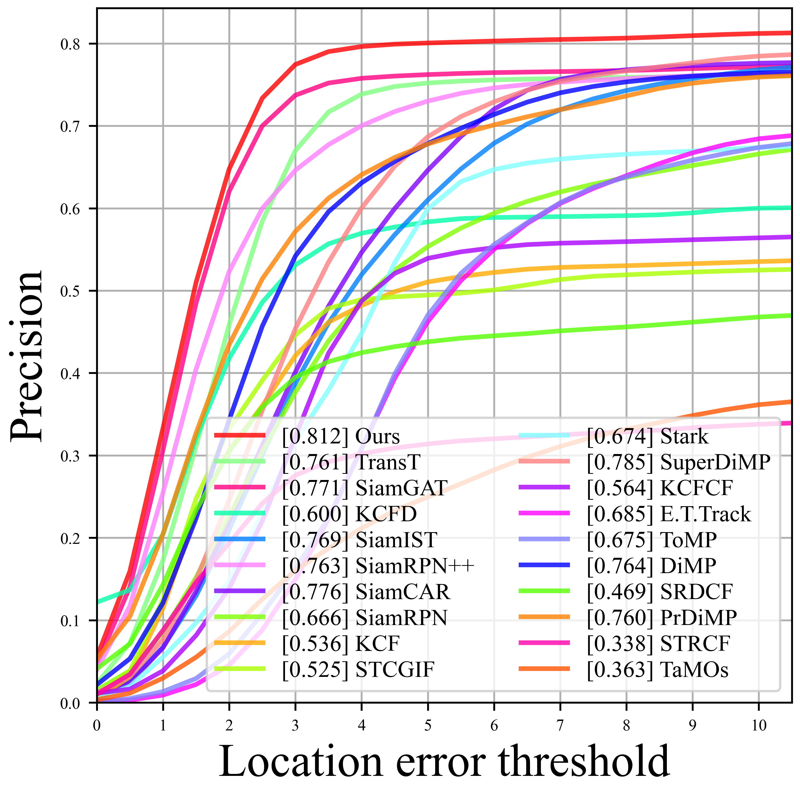
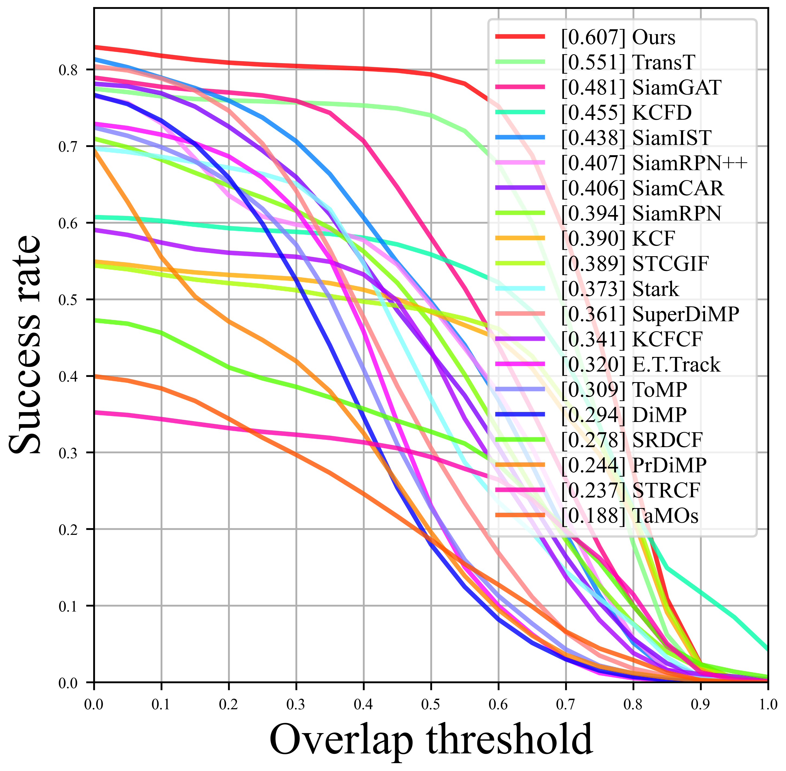

# SiamDA: A Detail-Attentive Siamese Network with Infrared Optical Saliency for Pixel-Level UAV Tracking
The main contents of this project can be summarized as follows:
1. A customized Siamese network is designed for tracking infrared UAVs, showing superior accuracy in tracking small targets on a public dataset, aiding urban UAV management.
2. A detail preservation network is developed to effectively address the issue of limited information in small UAVs and infrared target scenarios by deeply engaging with detail features.
3. The improved loss function and template update strategy enhance small UAV tracking precision.
***
## Performance
### Quantitative Comparison
The tracking evaluation based on the first 300 frames:
<table>
  <tr>
    <td></td>
    <td></td>
  </tr>
</table>
### Qualitative Comparison

***
## Environment
python=3.8
torch=1.13.1
cuda=11.6
torchvision=0.14.1
***
## Datasets
***
[[dataset]](https://pan.baidu.com/s/1FXYFSH2O0VoqVsUqIwwcGg?pwd=1111)

